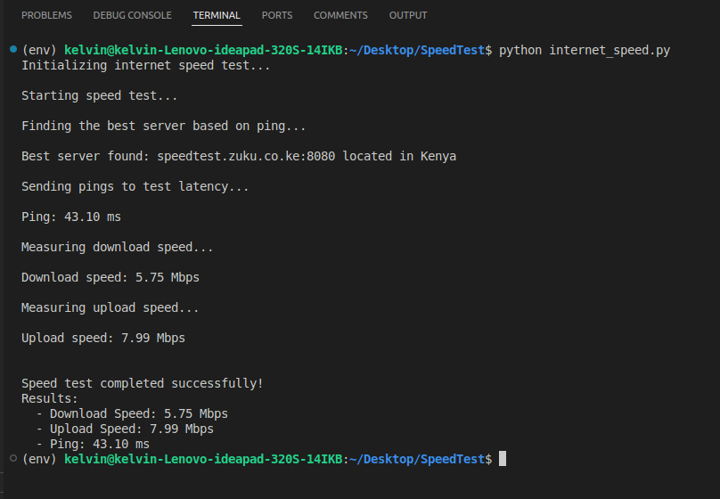

# Internet Speed Test CLI

A simple command-line application to measure your internet speed, including download speed, upload speed, and ping (latency). This CLI tool is built using Python's `Typer` library for creating the command-line interface and `speedtest-cli` for measuring internet speed.

## Features
- Measure **Download Speed** (in Mbps)
- Measure **Upload Speed** (in Mbps)
- Measure **Ping/Latency** (in milliseconds)
- Provides real-time feedback on each step during the speed test

## Requirements
- Python 3.7+
- `typer` library for CLI creation
- `speedtest-cli` library for performing speed tests

## Installation

1. Clone the repository:
   ```bash
   git clone https://github.com/yourusername/internet-speed-cli.git
   cd internet-speed-cli
   ```

2. Create and activate a virtual environment (optional but recommended):
   ```bash
   python3 -m venv venv
   source venv/bin/activate  # For Windows: venv\Scripts\activate
   ```

3. Install the required dependencies:
   ```bash
   pip install typer speedtest-cli
   ```

## Usage

Once the dependencies are installed, you can run the CLI application:

```bash
python internet_speed.py speed
```

### Example Output


```text
Initializing internet speed test...

Starting speed test...

Finding the best server based on ping...

Best server found: server1234.someprovider.net located in United States

Sending pings to test latency...

Ping: 18.43 ms

Measuring download speed...

Download speed: 45.76 Mbps

Measuring upload speed...

Upload speed: 11.23 Mbps

Speed test completed successfully!
Results:
  - Download Speed: 45.76 Mbps
  - Upload Speed: 11.23 Mbps
  - Ping: 18.43 ms
```



## How It Works

This CLI tool uses the `speedtest-cli` library to measure internet speed and `typer` to provide a simple and intuitive command-line interface. The application goes through the following steps:
1. **Select the best server**: It finds the best server to perform the speed test based on ping.
2. **Ping test**: Measures latency by sending pings to the server.
3. **Download test**: Measures the download speed in megabits per second (Mbps).
4. **Upload test**: Measures the upload speed in megabits per second (Mbps).

## Customization

You can further customize this tool by adding more commands or adjusting how the data is displayed. You can even add flags to choose specific servers or display additional details.